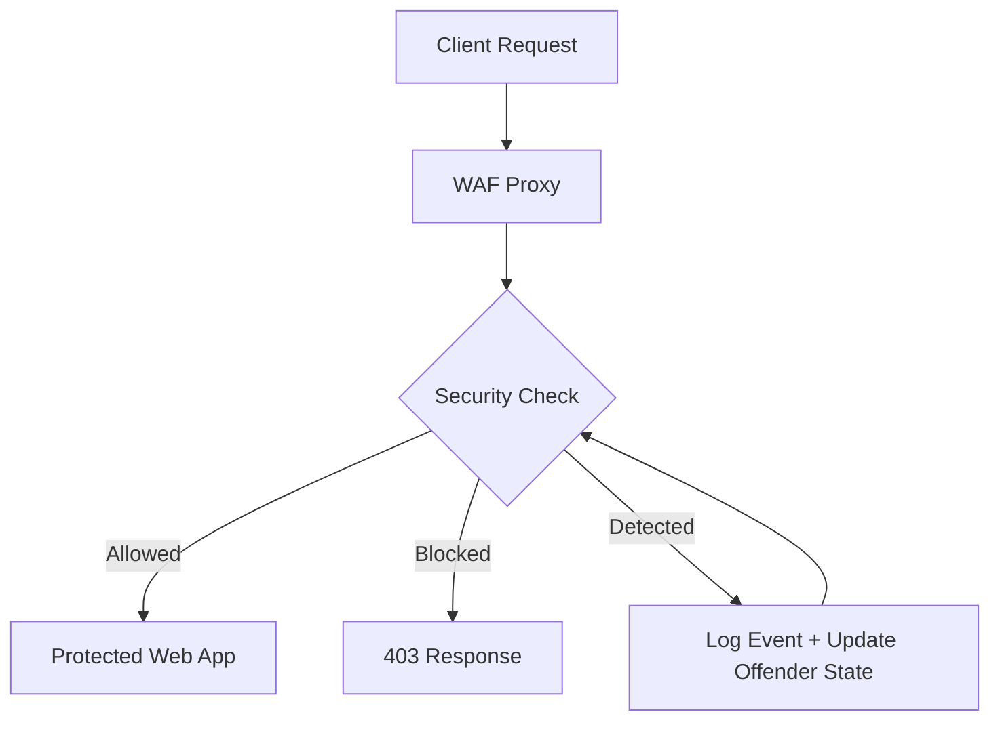

# Automated WAF

Automated Web Application Firewall in Python that works as a reverse proxy, inspects requests, scores suspicious payloads, logs events, and blocks repeat offenders.

## Overview

The WAF sits between the Internet and a protected web application.
It inspects every incoming request, evaluates it with a regex-based detection engine, assigns a threat score, and decides whether to allow, warn, temporarily block, or permanently block the client.

The current implementation includes:

- SQL injection detection.
- Cross-site scripting detection.
- Command injection detection.
- Directory traversal detection.
- Malicious user-agent detection.
- Basic bot traffic detection.
- Rate limiting.
- Offender tracking and auto-block escalation.
- SQLite event storage.
- A live dashboard and metrics API.

## How It Works

1. A request arrives at the FastAPI WAF.
2. `SecurityMiddleware` intercepts the request before it is forwarded.
3. `SecurityService` extracts the source IP, headers, cookies, URL parameters, path, and body.
4. `DetectionEngine` matches the request content against security rules.
5. The WAF calculates a score from the matched findings.
6. `RateLimiter` checks whether the client is sending too many requests.
7. `Blocker` applies the escalation policy for repeat offenders.
8. `DatabaseStore` records the event and offender count in SQLite.
9. `SecurityLogger` writes a structured security log entry.
10. Allowed traffic is proxied to the upstream web application.
11. Blocked traffic is returned with HTTP 403 and WAF headers.

## Architecture

- [app/main.py](app/main.py) wires the application, routes, middleware, database, blocker, and proxy.
- [app/middleware/security_middleware.py](app/middleware/security_middleware.py) performs inspection before the request reaches the proxy.
- [app/services/security_service.py](app/services/security_service.py) coordinates scoring, rate limiting, and offender escalation.
- [app/detection/engine.py](app/detection/engine.py) contains the regex detection rules.
- [app/database/store.py](app/database/store.py) persists security events and dashboard data in SQLite.
- [app/blocking/blocker.py](app/blocking/blocker.py) applies the warning, temporary block, and permanent block policy.
- [app/services/proxy.py](app/services/proxy.py) forwards allowed requests to the upstream application.
- [app/dashboard.html](app/dashboard.html) renders the live security dashboard.
- [waf_single.py](waf_single.py) is a standalone single-file version of the WAF.

## Configuration

Configuration is loaded from environment variables or the `.env` file.

Important settings:

- `WAF_UPSTREAM_URL`: upstream application to proxy to.
- `WAF_DATABASE_URL`: SQLite path, for example `sqlite:///./data/waf.db`.
- `WAF_BLOCK_THRESHOLD`: score at which requests are blocked.
- `WAF_RATE_LIMIT_REQUESTS`: maximum requests allowed per window.
- `WAF_RATE_LIMIT_WINDOW_SECONDS`: rate limit window size.
- `WAF_TEMP_BLOCK_SECONDS`: duration for temporary blocks.
- `WAF_OFFENDER_WARNING_THRESHOLD`: first escalation point.
- `WAF_OFFENDER_TEMP_BLOCK_THRESHOLD`: second escalation point.
- `WAF_OFFENDER_PERMANENT_BLOCK_THRESHOLD`: permanent block threshold.
- `WAF_BIND_PORT`: port used by the application.

## Requirements

- Python 3.12+
- FastAPI
- Uvicorn
- Pydantic
- Pydantic Settings
- HTTPX
- Pytest

Install dependencies with:

```bash
pip install -r requirements.txt
```

## Run The Modular App

Start the main application:

```bash
PATH="$HOME/.local/bin:$PATH" uvicorn app.main:app --host 0.0.0.0 --port 8080 --reload
```

Open these URLs:

- `http://127.0.0.1:8080/health`
- `http://127.0.0.1:8080/dashboard`
- `http://127.0.0.1:8080/api/metrics`

## Run The Single-File Version

If you want a one-file startup path, run:

```bash
PATH="$HOME/.local/bin:$PATH" WAF_BIND_PORT=8080 python3 waf_single.py
```

The single-file entrypoint contains the same workflow in one file for easier study or quick demos.

## Testing

Run the automated tests with:

```bash
PATH="$HOME/.local/bin:$PATH" pytest
```

Useful live tests:

```bash
curl -i http://127.0.0.1:8080/health
curl -i 'http://127.0.0.1:8080/test?q=%3Cscript%3Ealert(1)%3C/script%3E'
```

## Security Notes

- The regex engine is a strong baseline, but it is not a full replacement for behavioral detection or ML-based inspection.
- Replace the null block executor with real `iptables` or `nftables` integration before production deployment.
- Terminate TLS at Nginx or another edge proxy.
- Run the WAF with least privilege and isolate the backend application network.
- Review logs and dashboard alerts regularly to tune false positives.

## Future Roadmap

- PostgreSQL persistence.
- ML-based anomaly scoring.
- Threat-intelligence feeds.
- Geo-IP analysis.
- Behavioral analysis.
- SIEM integration.
- Kubernetes deployment support.

## Example Workflow


# WAF-web-application-firewall-
