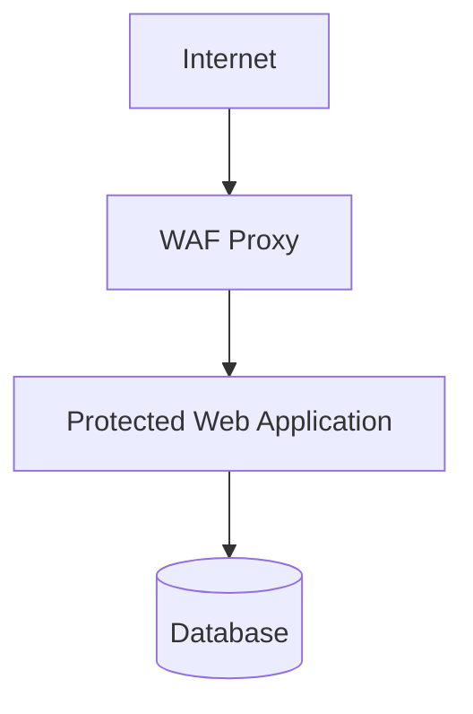

# Architecture

## Request Flow

1. Client sends a request to the WAF.
2. Middleware inspects headers, path, query params, cookies, and body.
3. Detection engine computes findings and a threat score.
4. Policy engine decides allow, warn, temp block, or permanent block.
5. Allowed traffic is forwarded to the upstream application.
6. Security events are logged and persisted.

## Modules

- `app/detection`: pattern detection and normalization.
- `app/services`: request orchestration, rate limiting, and proxying.
- `app/database`: SQLite persistence.
- `app/blocking`: offender escalation logic.
- `app/logging`: structured security event logging.
